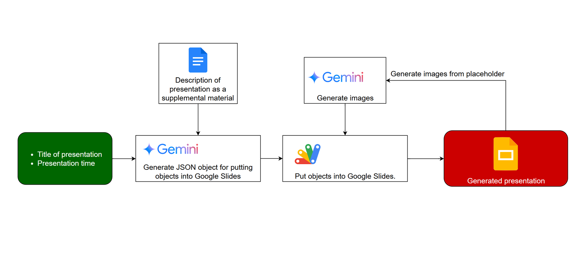
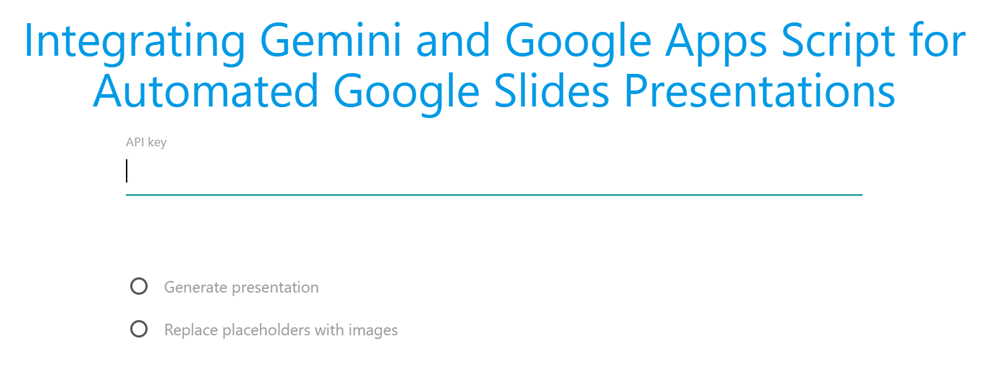
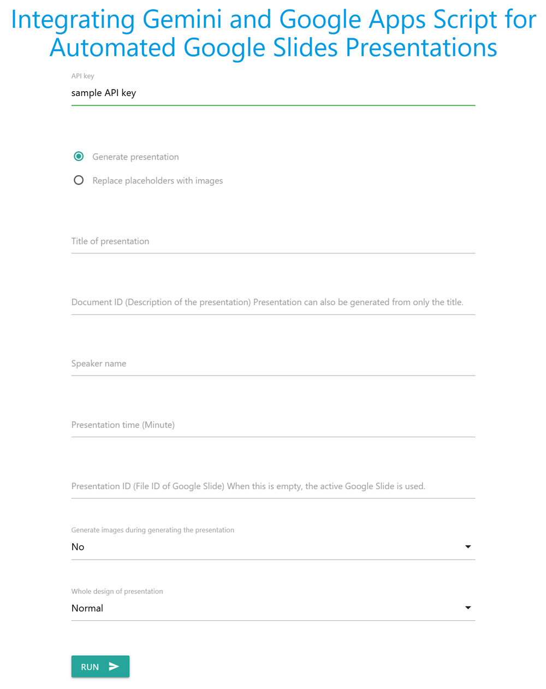
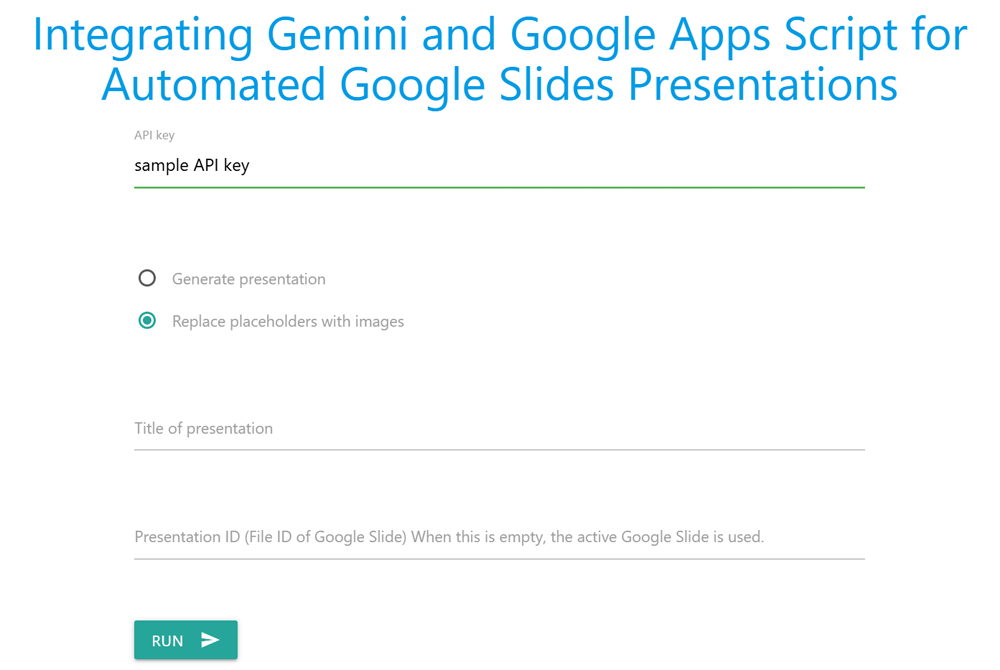
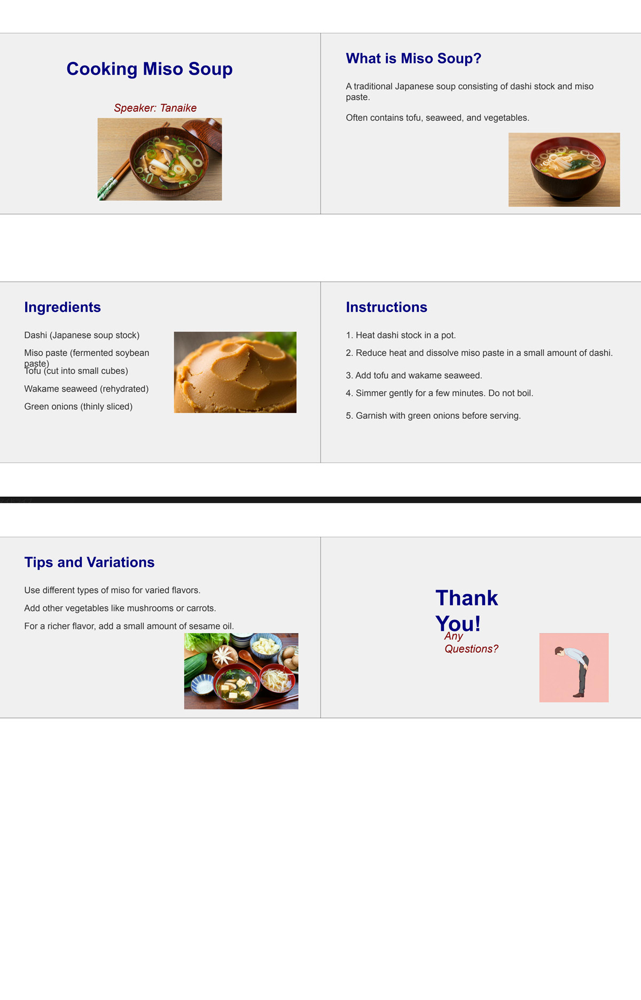
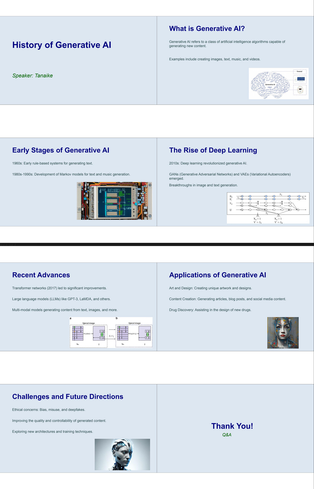
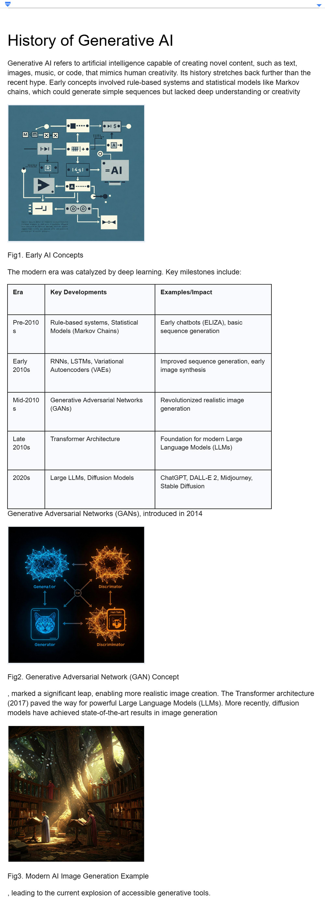
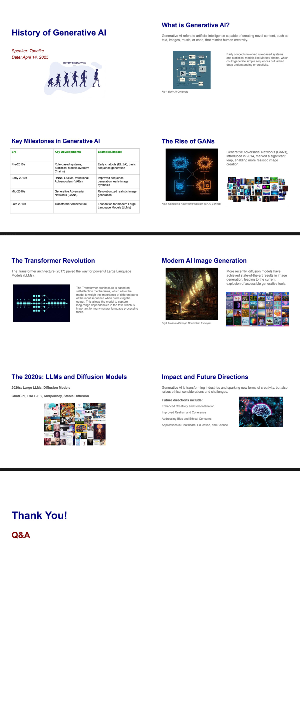
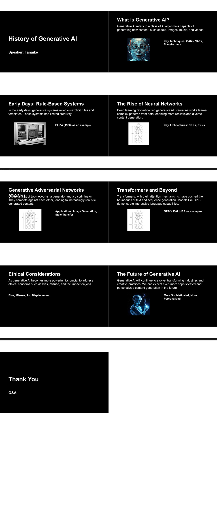

# Integrating Gemini and Google Apps Script for Automated Google Slides Presentations

## Abstract
Learn how Gemini AI and Google Apps Script automate Google Slides generation. A developed application demonstrates this synergy, streamlining initial presentation drafting and showcasing AI's automation potential within Google Workspace.

## Introduction
The field of AI, particularly large language models like Google's Gemini, is advancing rapidly. A powerful application of this technology involves integrating Gemini with Google Apps Script. Google Apps Script provides a seamless way to automate tasks across Google Workspace by natively handling authorization and interaction with services like Google Docs, Google Sheets, and Google Slides. By combining Gemini's generative capabilities with Apps Script, sophisticated automations become accessible.

Recently, I developed an application demonstrating this synergy: it automatically generates Google Slides presentations using Gemini, Google Slides, and Google Apps Script. To use it, you provide a text prompt outlining the desired topic or content. The script then interacts with the Gemini API to generate relevant text and structure for the presentation, subsequently using the Slides service within Apps Script to create the actual slides and populate them with the generated content.

This tool significantly speeds up the initial draft phase of presentation creation. While the generated slides serve as a solid foundation, users can then easily refine, customize, and add visuals to finalize their presentation. Believing this application could be valuable to others seeking to automate presentation creation or explore AI integration with Google Workspace, I am sharing the methodology and script publicly. This approach not only helps in creating presentations efficiently but also showcases the potential for automating various tasks across Google resources using AI.

# Workflow

The workflow of this application automates Google Slides presentation creation using Gemini and Apps Script. Users input the presentation title, time, and a detailed description. Gemini then generates a JSON object containing the slide content and structure. Google Apps Script takes this JSON and populates a new Google Slides presentation. Optionally, if placeholders for images exist, Apps Script can instruct Gemini to generate relevant images and insert them into the presentation. This process leverages Gemini's natural language understanding to structure content and Apps Script to programmatically manipulate Google Slides.

## Usage

### 1. Get API key

In order to use the scripts in this report, please use your API key. [Ref](https://ai.google.dev/gemini-api/docs/api-key) This API key is used to access the Gemini API.

### 2. Copy the sample Google Slides

In this case, I prepared a sample Google Sheet including the Google Apps Script. You can copy it and test the script.

When you access the following URL, you can copy the sample Google Slides.

[https://docs.google.com/presentation/d/1dqkIaZrjZVECkJqvvrWiW-IHNXKfexYRxmxEARF1jp0/copy](https://docs.google.com/presentation/d/1dqkIaZrjZVECkJqvvrWiW-IHNXKfexYRxmxEARF1jp0/copy)

This script also includes a Google Apps Script library. [Ref](https://github.com/tanaikech/GeminiWithFiles)

You can see the whole script in the script editor of the copied Google Slides and [my repository](https://github.com/tanaikech/).

### 3. Testing
In order to test this script, please run the following steps.

1. Open the copied Google Slides file.
2. Run "Open dialog" from the custom menu.
3. Authorize the scopes to use with Google Apps Script. This authorization is only once at this time.
4. When the script is run, a dialog is opened as follows.

  
  

5. **Set your API key to "API key".**
6. First, in order to generate a presentation, check the "Generate presentation" radio button. You can see the following dialog.

  
  

7. Set the title of the presentation you want to generate to "Title of presentation". Here, "cooking miso soup" is put as a sample title.
8. Here, "Document ID" remains a blank.
9. Set your name to "Speaker name". This name is used in the generated presentation.
10. Set the presentation time to "Presentation time". Here, 5 is put as a sample time.
11. "Presentation ID" remains a blank. In this case, the generated presentation is added to the active Google Slides. If you want to generate the presentation in another Google Slides, please set the presentation ID.
12. In this sample, set "No" to "Generate images during generating the presentation". When you set this as "Yes", the images are generated while the presentation is generated, simultaneously. But when the presentation is large, an error might occur on the Gemini side. At that time, you can generate images after this run.
13. Set "Normal" to "Whole design of presentation".
14. Click the "RUN" button. By this, the presentation is generated by the flow at the top image.
15. Confirm the generated slides in the active Google Slides. You can see the placeholder like `{{some texts}}`. If this is not included, please generate the presentation again.
16. Check the "Replace placeholders with images" radio button. You can see the following dialog.
  
  

17. You can see the previous title in "Title of presentation". If your title is different, please modify it. Here, the title of "cooking miso soup" is still used.
18. Click the "RUN" button. By this, the placeholders in the slides are converted to images by generating images with Gemini.

#### Sample 1
When the above steps are summarized, it becomes as follows.

| Name | Value |
| :-- | :--- |
| Title of presentation  | cooking miso soup  |
| Document ID (Description of the presentation) Presentation can also be generated from only the title. | |
| Speaker name | Tanaike |
| Presentation time (Minute) | 5 |
| Presentation ID (File ID of Google Slide) When this is empty, the active Google Slide is used. | |
| Generate images during generating the presentation | No |
| Whole design of presentation | Normal |

After the presentation is generated, please open this application and check the "Replace placeholders with images" radio button and click "RUN" button. By this, the plcaseholders are converted to the generated images.

When this step is run, the following presentation is generated. You can see the presentation including the texts and images. Also, you can see the text of the subtitles of the actual speeches for each page in the "Notes" section of Google Slides. It will help you understand each page.

#### Sample 2
As a sample 2, the following setting is used. In this setting, "Generate images during generating the presentation" is "Yes". So, the images are generated during generating the presentation.

| Name | Value |
| :-- | :--- |
| Title of presentation  | history of generative AI |
| Document ID (Description of the presentation) Presentation can also be generated from only the title. | |
| Speaker name | Tanaike |
| Presentation time (Minute) | 5 |
| Presentation ID (File ID of Google Slide) When this is empty, the active Google Slide is used. | |
| Generate images during generating the presentation | Yes |
| Whole design of presentation | Normal |

The following presentation is generated by this setting.

### 4. Options

Describe the details of "Document ID" and "Whole design of presentation" under the "Generate presentation" radio button is set.

#### Document ID (Description of the presentation) Presentation can also be generated from only the title.

When you want to generate the presentation by reflecting your materials, you can use "Document ID". The Google Docs file can include text, tables, and images. The sample Google Docs file is as follows.

When a presentation is generated with the title of "History of generative AI" and this Google Docs file, the setting is as follows. The document ID of the above Google Docs file is set.

| Name | Value |
| :-- | :--- |
| Title of presentation  | history of generative AI |
| Document ID (Description of the presentation) Presentation can also be generated from only the title. | ### document ID ### |
| Speaker name | Tanaike |
| Presentation time (Minute) | 5 |
| Presentation ID (File ID of Google Slide) When this is empty, the active Google Slide is used. | |
| Generate images during generating the presentation | Yes |
| Whole design of presentation | Normal |

When this setting is used, the following presentation is generated. You can see that a presentation was generated by reflecting the Google Docs file.

#### Whole design of presentation

You might want to change the presentation style. At that time, you can achieve it using "Whole design of presentation". The sample setting is as follows. In this setting, "Dark" is set to "Whole design of presentation". And, other parameters are the same as "Sample 2".

| Name | Value |
| :-- | :--- |
| Title of presentation  | history of generative AI |
| Document ID (Description of the presentation) Presentation can also be generated from only the title. | |
| Speaker name | Tanaike |
| Presentation time (Minute) | 5 |
| Presentation ID (File ID of Google Slide) When this is empty, the active Google Slide is used. | |
| Generate images during generating the presentation | Yes |
| Whole design of presentation | Dark |

## Important points for using Gemini

- In order to automate the placement of text and images on Google Slides, I utilized Google Apps Script. This involved listing relevant methods such as `insertText` and `insertImage`, complete with their necessary arguments. Based on this list, I created a JSON schema and used it to generate JSON objects. Subsequently, I employed GAS to parse this JSON and position each element onto the Google Slides.
- In order to incorporate pre-existing images, I implemented a workflow where these images were uploaded to Gemini. Gemini would then return unique identifiers for each uploaded image. These identifiers were incorporated into the generated JSON, enabling the creation of slides that included these existing images.
- Due to a current limitation where generating all required images in a single operation is often unreliable, I adopted a two-step approach. Initially, I used GAS to insert placeholder text onto the Google Slides where the images were intended to be placed. Later, a separate process would search for these placeholders and replace them with the corresponding generated images.

## Note

- The generated presentation might be imperfect for you. So, you can use this presentation as a draft presentation. You can adjust and modify the position, the width, and the height of the text and image. 
- When a large presentation is created, an error like `The model is overloaded. Please try again later.` might occur when the images are generated. At that time, please try it later.
- In order to adjust your presentation, you can modify my original prompt in the script.
- When I created this application, Gemini 2.5 could not return the result with the response mimeType and the response schema of "application/json". So, I used Gemini 2.0. However, I believe that this will be resolved in the future update. At that time, a more practical presentation will be able to be generated.

---

# Licence

[MIT](LICENCE)

# Author

[Tanaike](https://tanaikech.github.io/about/)

[Donate](https://tanaikech.github.io/donate/)

# Update History

- v1.0.0 (April 15, 2025)

  1. Initial release.

[TOP](#top)

